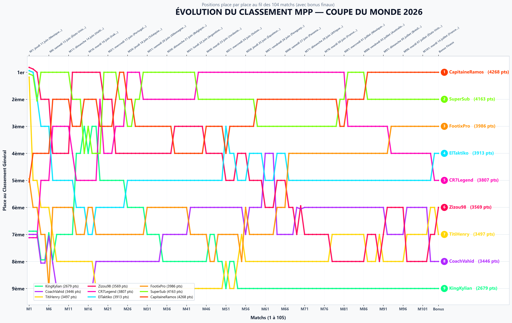
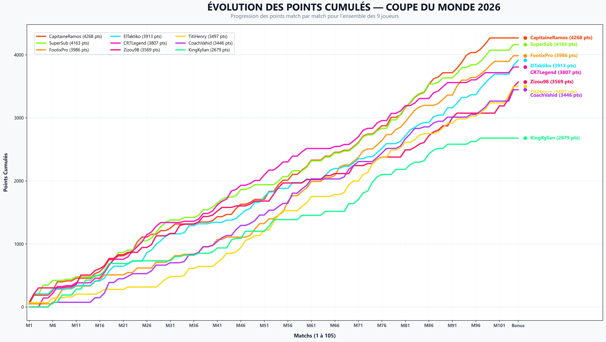

# 🏆 MPP Dashboard & Analytics — Mon Petit Prono 2026


A complete and autonomous ecosystem for data extraction, statistical analysis, and dynamic visualization for your **Mon Petit Prono (MPP)** leagues (World Cup, Euro, domestic leagues).


---

## 📌 1. Project Overview

### Overview
The **MPP Dashboard & Analytics** project automates the collection of predictions, actual match results, and points accumulated by all members of an MPP league to generate an interactive neon analytics dashboard, high-definition charts, GIF animations, and MP4 videos.

### 🌟 Key Features
- 🏷️ **Dynamic League Name & Code (`league_info.json`)**:
  - **Multi-level extraction pipeline**: Automatic detection of the exact league name directly from the MPP DOM using regular expressions (searching for `InsatiableDisplay` and `24px`), BeautifulSoup, and Selenium JS queries.
  - **Automatic HTML decoding (`html.unescape`)**: Automatic conversion of HTML entities (e.g., `My League &amp; Co` $\rightarrow$ `My League & Co`).
  - **Full integration**: Elegant display in the header, subtitles, `<title>` tag of dashboards, and the top banner of GIFs/MP4s.
- 🔒 **Production-Grade Anti-Dox Anonymous Mode (`--anon` / `anonymizer.py`)**:
  - **Direct anonymization on creation**: The scraper and generators write CSV, JSON, and HTML files directly in an anonymized format to disk (no folder containing the real league code is created when using `--anon`).
  - **Length-preserving deterministic randomized league code**: Generation of an anonymous code in the same format and length (e.g., `YOUR_LEAGUE` (8 chars) $\rightarrow$ `8ZSJA33T`).
  - **Popular & fun usernames**: Deterministic 1-to-1 mapping of 100 famous football/gaming culture usernames (`Zizou98`, `ElTaktiko`, `CoachVahid`, `KingKylian`...).
  - **100% Anonymized Web URL & Redirection**: Automatic redirection to `http://localhost:8080/8ZSJA33T/dashboard_mpp.html`.
  - **Automatic log cleanup**: Automatic deletion of temporary log and debug files (`mpp_scraper.log`, `intercepted_requests.txt`, `debug_profile.html`) upon error-free completion.
- 📊 **Interactive Neon Dashboard (`dashboard_mpp.html`)**:
  - **Prediction Accuracy**: Analysis of predicted outcomes (1X2), exact scores, and total points.
  - **Stars & Rarity Breakdown (Top 3)**: Full breakdown of earned rarities (Exact Score, Rare, Very Rare, Mega Rare, Ultra Rare).
  - **Missed Matches & Actual Success Rate**: Efficiency percentage calculated based on matches actually played (out of 104 real matches), with tie-breakers prioritizing lower success rates on ties.
  - **Excel-Style Interactive Sorting**: Instant sorting on any column by clicking header cells (with `▲` / `▼` / `↕` indicators).
  - **Timeline & Automatic Positioning on Bonuses**: Interactive slider automatically positioning itself on Final Bonuses upon load or bonus toggling.
  - **Bonus Management**: Toggle option to include or exclude the final bonus phase.
- 🤪 **Fun Trophies & Wild Bets (Full Support for Ties)**:
  - ⭐ **Craziest Exact Score Streak**: Longest streak of consecutive exact score predictions (stars ⭐).
  - 🚀 **Craziest Comeback**: Maximum gap between a player's lowest position and their highest position reached later.
  - 📉 **The Free Fall**: Maximum gap between a player's highest position and their lowest position reached later.
  - 👑 **The King of Position**: The participant who spent the most matches at the exact same rank.
  - 🏳️ **Earliest Abandonment**: Automatic detection of the player who stopped making bets earliest.
  - 🤝 **Tie Handling**: Support for tied results across all trophies with multi-player badges, distinctive colors, and detailed descriptions.
- 🎬 **Animations & HD Media (Multi-Quality Export Low / Medium / HD)**:
  - **⚡ Low (640p)**: Ultra-fast export and lightweight file size (~1-2 MB), perfect for instant sharing.
  - **⚙️ Medium (960p)**: Balanced standard resolution (~4-5 MB) for messaging apps and social media.
  - **💎 HD (1400p / 150 DPI)**: Maximum quality with zero frame skipping (100% of matches captured) and ultra-sharp rendering.
  - Share-ready **MP4 HD** video rendering.
  - High-resolution static PNG charts (`evolution_classement.png`, `evolution_points.png`).
- 🌐 **Integrated Web Server (`server.py`)**:
  - Local HTTP interface to control scraping, intercept sessions, and regenerate dashboards right from a web browser.

---

## 🛠️ 2. Installation & Prerequisites

### System Prerequisites
- **Python 3.9+** (Recommended: Python 3.10, 3.11, or 3.12)
- **Firefox** (required if using the automated Selenium scraper)
- **FFmpeg** (optional, recommended for MP4 video export)

### Python Dependencies
Install all required libraries using `pip`:

```bash
pip install pandas matplotlib imageio imageio-ffmpeg beautifulsoup4 selenium urllib3
```

---

## 🚀 3. User Guide

### Option A: All-in-One Master Batch Pipeline (`run_all.py`) — Recommended CLI
Execute the complete workflow (MPP Scraping + Generation of all resources) sequentially for one or more leagues:

```bash
# Interactive mode (enter one or multiple league codes)
python run_all.py

# Multi-league Batch mode directly from the command line
python run_all.py LEAGUE1 LEAGUE2

# Anti-Dox Anonymous Mode (automatic masking of usernames and league code)
python run_all.py LEAGUE1 --anon
```
*The script accepts multiple league codes separated by space or comma, runs scraping and generation for each sequentially, and prints a summary report at the end.*

---

### 🔒 Anti-Dox Anonymous Mode (`anonymizer.py` & `--anon`)
If you want to publish your dashboards, GIFs, or videos on a public platform without revealing your league members' identities or your secret league code:
- **Via the `--anon` flag**: Can be appended to any CLI command (`python run_all.py LEAGUE1 --anon`, `python generate_all.py LEAGUE1 --anon`, etc.).
- **Via the Web Interface (`server.py`)**: Simply check the **🔒 Anonymous Mode** box on `http://localhost:8080`.
- **Via the dedicated script `anonymizer.py`**:
  ```bash
  python anonymizer.py YOUR_LEAGUE
  ```
  *Creates a duplicated `YOUR_LEAGUE_anon/` folder containing all anonymized CSV and JSON files.*

*All real usernames are deterministically replaced with a list of **100 famous & fun usernames** (e.g., `Zizou98`, `ElTaktiko`, `CoachVahid`, `PronoMaster`, `FootixPro`...), and the league code is replaced with a length-preserving deterministic random code (e.g., `8ZSJA33T`).*

#### 🔑 Login & Session Management (`mpp_session.json`):
- **If a session is already saved and valid** (`mpp_session.json` present in the directory):
  The scraper automatically restores Auth0 authentication tokens in the background. Collection proceeds directly without requiring user interaction.
- **If no session is present (or if the session has expired)**:
  1. A Firefox browser window opens automatically on the Mon Petit Prono home page (`https://mpp.football/`).
  2. Simply log into your MPP account in the Firefox window.
  3. Return to your terminal and press the `[ENTER]` key.
  4. The scraper automatically captures JWT session tokens and saves them to `mpp_session.json`. Subsequent runs will be 100% automated.

---

### Option B: Usage via Integrated Web Server (`server.py`)
Launch the local HTTP server to control data collection from a web graphic interface:
```bash
python server.py
```
1. Open your browser at `http://localhost:8080`.
2. Enter your **MPP League Code** (e.g., `YOUR_LEAGUE`).
3. Start scraping or regenerate the dashboard with a single click.

---

### Option C: Global Generation from Existing CSVs (`generate_all.py`)
If you already have extracted CSV files in your league folder (`YOUR_LEAGUE/`):
```bash
python generate_all.py YOUR_LEAGUE
```
*Generates PNG charts, GIF/MP4 animations, the simple dashboard, and the interactive neon dashboard.*

---

### Option D: Specific Dashboard Generation (`generate_enhanced_dashboard.py`)
To regenerate only the interactive HTML dashboard:
```bash
python generate_enhanced_dashboard.py YOUR_LEAGUE
```

---

## 🔬 4. Technical Guide & Internal Architecture

### 1. HTML DOM Scraping & Multi-Level League Name Extraction (`mpp_scraper.py`)
- **League name extraction pipeline**:
  1. *Direct HTML Regular Expression*: Instant detection of `InsatiableDisplay` font styles and `font-size: 24px` within the HTML code.
  2. *BeautifulSoup4 Parsing*: Recursive parsing of nodes and `class` / `style` attributes.
  3. *Selenium JavaScript DOM Inspection*: Live querying of elements rendered in the browser.
  4. *`html.unescape()` Decoding*: Automatic processing of HTML entities (`&amp;` $\rightarrow$ `&`).
- **Match data extraction**: Retrieval of match cards, dates, submitted predictions (`Prono_MPP`), real match scores (`Score_Reel`), and rarity badges (`Bonus_Tag`).
- **Authentication & Auth0 Cookies**:
  - Support for Auth0 authentication JWT tokens.
  - Automatic reconstruction of Auth0 `localStorage` session structure (`com.monpetitprono.monpetitpronoapp.secureStorage\accessToken`).
  - Restoration and saving of session tokens in JSON format (`mpp_session.json`).

### 2. Data Processing & Bonus Management (`generate_enhanced_dashboard.py`)
- **`points_cumules.csv` file**: Master file tracking points accumulated by each participant match by match.
- **Virtual Bonus Row Filtering**: Detection and exclusion of the "Bonus" row to calculate the exact number of matches played (**104 real matches**).
- **Fun Trophies Algorithms (with Tie Handling)**:
  - *Exact Score Streak*: Detection of the longest contiguous sequence of matches with `is_star == True`.
  - *Comeback / Drop*: Matrix analysis over the rank time series $R_{i,p}$ to find $\max(R_{i,p} - R_{j,p})$ with $i \le j$.
  - *King of Position*: Occurrence frequency of each position $\operatorname{mode}(R_{*,p})$.
  - *Abandonment*: Detection of the index $m$ beyond which no predictions were placed up to the last match of the tournament.
  - *Ties*: Grouping of all participants achieving the maximum score for each category and multi-badge formatting.

### 3. Graphics & Visualizations
- **Matplotlib & Bump Charts**: Evolution curve generation with glow effects, interpolation smoothing, and path effects for text outlines.
- **Chart.js & Custom HTML Tooltip**: Dynamic HTML dashboard with custom tooltips displaying full match details on hover over the chart.

### 4. Media Generation & Export (GIF & MP4) (`generate_gif.py`)
- **HTML5 Canvas & Offscreen Rendering**: Step-by-step frame capture with interpolation and animated markers.
- **Multi-Quality Support (Low / Medium / HD)**: Dynamic selection of resolution (640p, 960p, 1400p), sampling, and color palette.
- **GIF Encoding & FFmpeg MP4**: Encoding via `imageio` and `imageio-ffmpeg` with automatic resizing of images to dimensions divisible by 16 (video codecs).

### 5. Local Web Server & Orchestration (`server.py`)
- **Asynchronous HTTP Server (`HTTPServer`)**: Multithreaded Python HTTP server managing REST APIs (`/api/run`, `/api/confirm_login`, `/api/session`, `/api/status`).
- **Task Management & Threading Locks**: Usage of `threading.Lock()` to track progress of `subprocess.Popen` sub-processes and interact with their standard input (`stdin`).

---

## 🖼️ Sample Outputs & Visualizations

### 📊 Ranking Evolution Chart (`evolution_classement.png`)


### 📈 Points Evolution Chart (`evolution_points.png`)


---

## 📜 License & Contribution
Project licensed under the **MIT License**. Free to use for all your prediction leagues with friends!

